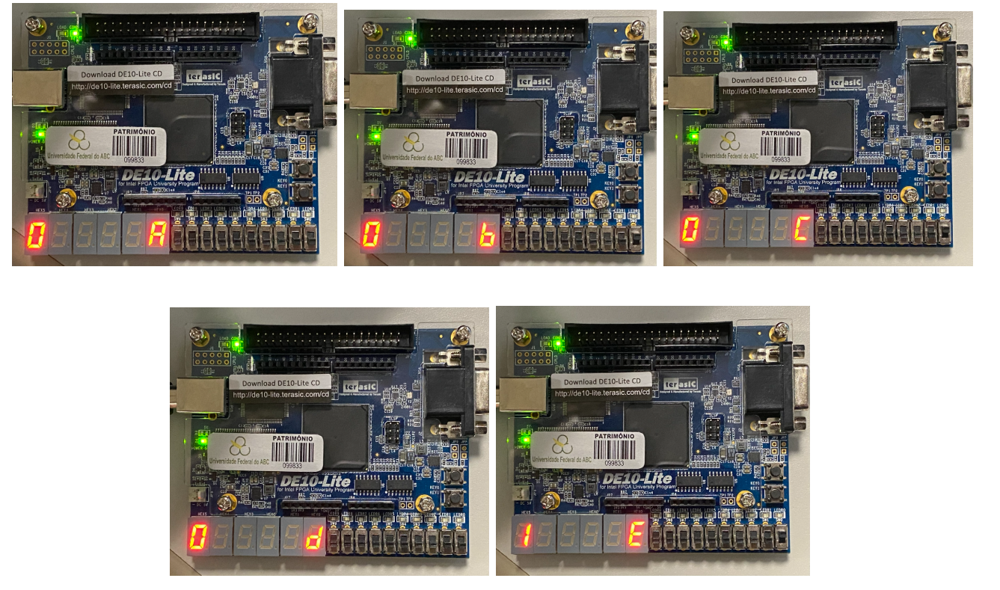
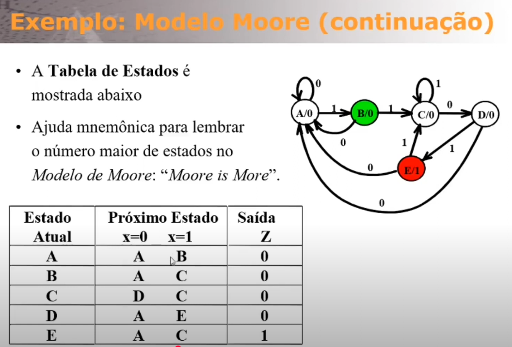
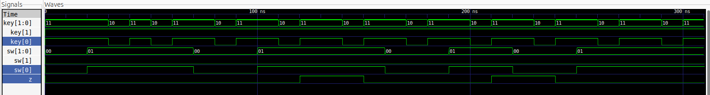

# Sequence Detector (VHDL)

This project implements a sequence detector using a Finite State Machine (FSM) in VHDL. It detects the binary sequence **1101** on input `X` (controlled by `SW(0)`). When the sequence is recognized, output `Z` is set to `'1'` for one clock cycle; otherwise, `Z` remains `'0'`.




## 🖲️ How to Use (DE10-Lite Board)

- **Button (KEY[0]) is Active Low:**  
  The system uses KEY[0] as the clock input. Since the button is active low, a clock edge is generated when you press (logic '0') and release (logic '1') the button. The FSM advances on the **rising edge** (when KEY[0] goes from '0' to '1').
- **Reset (KEY[1]) is Active Low:**  
  Hold KEY[1] low to reset the FSM to its initial state.
- **Input Bit (SW[0]):**  
  Before each clock (button press), set SW[0] to indicate the next input bit:
  - `SW[0] = 1` → Next input is logic '1'
  - `SW[0] = 0` → Next input is logic '0'
- **Output (Z):**  
  The output `Z` goes high (`'1'`) for one clock cycle when the sequence `1101` is detected.

## 🔍 How It Works

### FSM States
- **A**: Initial state (waiting for first '1')
- **B**: Got first '1'
- **C**: Got '11'
- **D**: Got '110'
- **E**: Got '1101' (detection state, `Z=1`)

The FSM supports **overlapping detection**. For example, in the input `1101101`, the sequence `1101` is detected twice. After a successful detection, the FSM transitions to earlier states to continue monitoring for new sequences.

## 🛠️ Installation

Install the required tools:
```bash
sudo apt-get install ghdl gtkwave
```

## ▶️ Running the Simulation


**First, enter the `sequence-detector-moore-DE10-Lite` directory:**
```bash
cd sequence-detector-moore-DE10-Lite
```

You can use the following command to run all steps at once:

```
   ghdl -a quartus_moore.vhd && ghdl -a quartus_moore_testbench.vhd && ghdl -e quartus_moore_testbench && ghdl -r quartus_moore_testbench --vcd=resposta.vcd --stop-time=500ns && ghdl -r quartus_moore --wave=resposta.ghw && ghdl -r quartus_moore_testbench --wave=resposta.ghw --stop-time=500ns && gtkwave resposta.vcd &
```

Or step-by-step:

1. **Analyze the VHDL files:**
   ```bash
   ghdl -a quartus_moore.vhd
   ghdl -a quartus_moore_testbench.vhd
   ```
2. **Run the testbench and generate VCD waveform:**
   ```bash
   ghdl -e quartus_moore_testbench
   ghdl -r quartus_moore_testbench --vcd=resposta.vcd --stop-time=500ns
   ```
3. **Run and generate GHW waveform:**
   ```bash
   ghdl -r quartus_moore --wave=resposta.ghw
   ghdl -r quartus_moore_testbench --wave=resposta.ghw --stop-time=500ns
   ```
4. **View the waveform in GTKWave:**
   ```bash
   gtkwave resposta.vcd &
   ```

## 🧪 Testbench Explanation

The testbench (`quartus_moore_testbench.vhd`) applies several input sequences to the detector:
- **Sequence 1:** `1 1 0 1` → Should trigger `Z='1'` after the last '1'.
- **Sequence 2:** `1 1 0 1` again (overlapping) → Should trigger `Z='1'` again.
- **False Pattern:** `1 0 1 1` → Should **not** trigger `Z='1'`.

### How to Interpret in GTKWave
- Open `resposta.vcd` in GTKWave.
- Add signals `KEY`, `SW`, and `Z` to the waveform view.
- Look for moments when `Z` goes high (`'1'`). This indicates the sequence `1101` was detected.
- You can correlate the input `SW(0)` transitions with the output `Z` to verify correct detection and overlapping behavior.

#### Moore Machine and State Table


#### Example Waveform


## 📄 Additional Notes
- The FSM uses an asynchronous reset (`KEY[1]` active low).
- The clock is generated by KEY[0] (active low, rising edge sensitive).
- The design is suitable for educational purposes and can be extended for other sequences.
- Website to test 7-segment leds: [https://g.co/gemini/share/8abe6d723705](https://g.co/gemini/share/8abe6d723705)

---

For more details, see the source files and comments in `quartus_moore.vhd` and `quartus_moore_testbench.vhd`.
